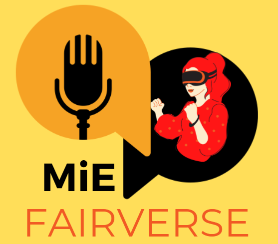
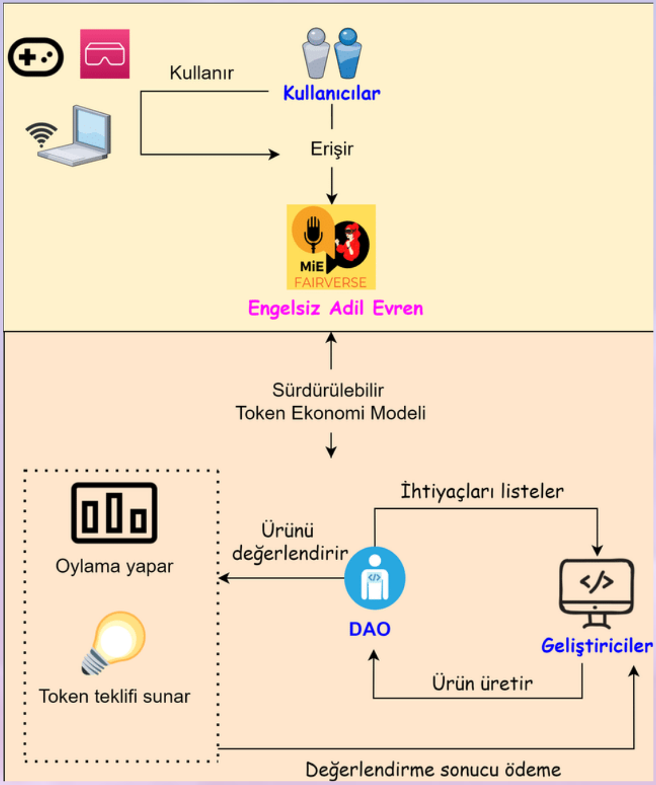
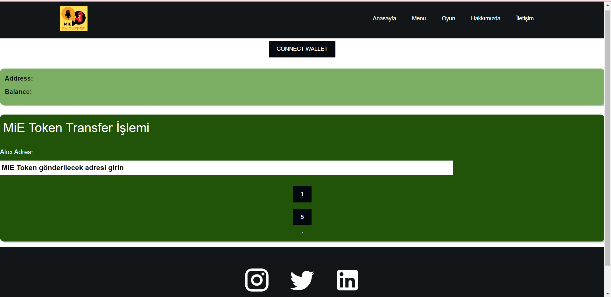

# Fairverse Token

Projeyi sürdürülebilir kılmak amacıyla token ekonomi modelini tasarladık.

  
İçindekiler

  <ol>
    <li><a href="#fairverse-token">Fairverse Token</a></li>
    <li><a href="#-sürdürülebilir-token-ekonomi-modelinin-yapılma-amacı">Sürdürülebilir Token Ekonomi Modelinin Yapılma Amacı</a></li>
    <li><a href="#-takım-üyeleri">Takım Üyeleri</a></li>
    <li><a href="#-sistem-modeli">Sistem Modeli</a></li>
    <li><a href="#-tasarım-ekran-görüntüsü">Tasarım Ekran Görüntüsü</a></li>
    <li><a href="#-kullanılan-teknolojiler">Kullanılan Teknolojiler</a></li>
    <li><a href="#-tanıtım-videosu">Tanıtım Videosu</a></li>
    <li><a href="#-i%CC%87leti%C5%9Fim">İletişim</a></li>
  </ol>

## 🖥 Sürdürülebilir Token Ekonomi Modelinin Yapılma Amacı

Sanal ortamımıza şimdiye kadar eklenen özelliklerin eklenmesi aylarımızı aldı. Üç geliştirici ile yapabileceğimizin en iyisini yapmaya çalıştık. Ancak sanal bir 
evren oluşturmak için daha fazla animasyon, nesne ve özelliklere ihtiyacımız vardı. Projeyi sürdürülebilir kılmak amacıyla token ekonomi modelini tasarladık. DAO; 
topluluk tarafından yönetilen ve merkezi bir otoriteye sahip olmayan oluşumlardır. Bu sistemde DAO sanal ortamın ihtiyaçlarını listelemektedir.

## 👩‍💻👨‍💻👩‍💻 Takım Üyeleri

<table>
  <tr>
    <td align="center"><a href="https://github.com/missreyyo"> <b>
    Reyhan Duygu</b></a>  <b>Proje Yürütücüsü</b></a> </a></td>
    <td align="center"><a href="https://github.com/MrBuluc"> <b>
    Hakkıcan Bülüç</b></a>  <b>Akıllı Sözleşme Geliştiricisi</b></a> </a></td>
    <td align="center"><a href="https://github.com/EAtalay8"> <b>
    Enes Atalay</b></a>  <b>Unity Geliştiricisi</b></a> </a></td>
  </tr>
</table>

## 🌈 Sistem Modeli

  

Kullanıcılarımız bir bilgisayar ve sanal gerçeklik gözlüğü ile Engelsiz Adil Evren'i kullanırlar. Sonra sürdürülebilir token modeli devreye girer.  DAO; topluluk 
tarafından yönetilen ve merkezi bir otoriteye sahip olmayan oluşumlardır. Bu sistemde DAO sanal ortamın ihtiyaçlarını listelemektedir. Örneğin DAO salıncak istiyor. 
Geliştirici salıncağı üretip gönderir. Eğer salıncak ortamımıza uygunsa DAO tarafından oylama yapılarak salıncağı yapan kişiye Token teklifi sunulur. Sonuç olarak 
token kazanan geliştirici motive bir şekilde ortamımıza yeni ürünler üretir. Bu şekilde sistem kendi kendini sürdürür.

## 📷 Tasarım Ekran Görüntüsü

## 🛠 Kullanılan Teknolojiler

<table style="float:right;">
  <tr>
    <td></td>
    <td></td>
    <td></td>
  </tr>
  <tr>  
    <td></td>  
    <td></td>  
    <td></td>  
  </tr>
  <tr>  
    <td></td>  
    <td> </td>  
    <td></td>  
  </tr>
</table>

## 📽 Tanıtım Videosu

## 📱 İletişim

  
<b> <samp> Bizimle İletişime Geçin </samp></b>

   
  <samp>
  <b><h2 style="color: #fc6203">Fairverse</h2></b>
  
  
   
  Projenin Linki: <a href="https://github.com/Fairverse/Fairvese-Token">Fairverse Token</a>
   
   
  Websitemiz: <a href="https://linktr.ee/mvrg"> Websitemiz</a>

